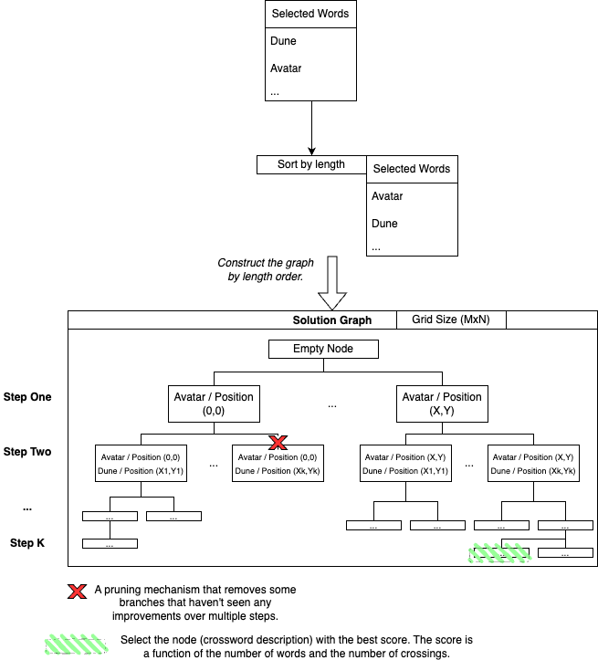

# Crossword Automatic Generation Documentation

This file aims to give some details about the internal mechanism (or high-level strategy) of the repo.

## Internal mechanism

## Internal database

_Database Name_:
`
sqlite> .databases
main: ./CrosswordSolver/database/questions-answers.db r/w
`
_Database Table_:

CREATE TABLE CLUEANSWER (
    CAId INTEGER PRIMARY KEY, -- Automatically increments
    Clue TEXT NOT NULL,
    Answer TEXT, -- Removed VARCHAR(32) for compatibility, but TEXT works fine
    Lang TEXT NOT NULL -- Eng = English / Fr = French / etc...

);

_Database Debug_:

Open the database:
- Run `cd database && sqlite3 clue-answer.db`.

Get the different commands:
- Run `.help`.

Get some specific information about the tables:
- Run `.databases`, `.tables`, `.schema CLUEANSWER`.
- Run `SELECT * FROM CLUEANSWER;`.

Insert new data:
- Run `INSERT INTO CLUEANSWER(Clue, Answer, Lang) VALUES('He is best known for the motoring programmes Top Gear.', 'Clarkson', 'Eng');`.

Modify table definition:
- Run `ALTER TABLE CLUEANSWER ADD COLUMN level INTEGER DEFAULT 0;`.

db-browser-for-sqlite is used to manage the db by the internal developers.

## Performance

#### Strategy 

- Grid size impact for a fix number of words (Min=5,Max=14).
- Input words impact for a fix grid size (Min=5,Max=9).

_Important consideration_:
- The average size of the words matters as well. 
- In the performance test, most of the words are roughly 5 characters long.

#### Last Performance Results:

*Results in microseconds*

Grid(5,5) x Words(5) = 47
Grid(5,5) x Words(6) = 34
Grid(5,5) x Words(7) = 44
Grid(5,5) x Words(8) = 40
Grid(5,5) x Words(9) = 55
Grid(5,5) x Words(10) = 83
Grid(5,5) x Words(11) = 115
Grid(5,5) x Words(12) = 112
Grid(5,5) x Words(13) = 110
Grid(6,6) x Words(5) = 324
Grid(6,6) x Words(6) = 453
Grid(6,6) x Words(7) = 451
Grid(6,6) x Words(8) = 513
Grid(6,6) x Words(9) = 656
Grid(6,6) x Words(10) = 784
Grid(6,6) x Words(11) = 866
Grid(6,6) x Words(12) = 1049
Grid(6,6) x Words(13) = 1262
Grid(7,7) x Words(5) = 6516
Grid(7,7) x Words(6) = 15277
Grid(7,7) x Words(7) = 13702
Grid(7,7) x Words(8) = 19250
Grid(7,7) x Words(9) = 28815
Grid(7,7) x Words(10) = 35346
Grid(7,7) x Words(11) = 43801
Grid(7,7) x Words(12) = 54835
Grid(7,7) x Words(13) = 60735
Grid(8,8) x Words(5) = 140314
Grid(8,8) x Words(6) = 469577
Grid(8,8) x Words(7) = 481820
Grid(8,8) x Words(8) = 874755
Grid(8,8) x Words(9) = 1395391
Grid(8,8) x Words(10) = 1893512
Grid(8,8) x Words(11) = 2457898
Grid(8,8) x Words(12) = 3176996
Grid(8,8) x Words(13) = 3483068

#### Comments

We can notice a quite poor performance of the tool for grids size over 8x8.

## Review

This repo has used ChatGpt in order to _review_ the internal code. The following prompt has been used:
`Can you review the following code to make sure it follows high standard C++ practice?`